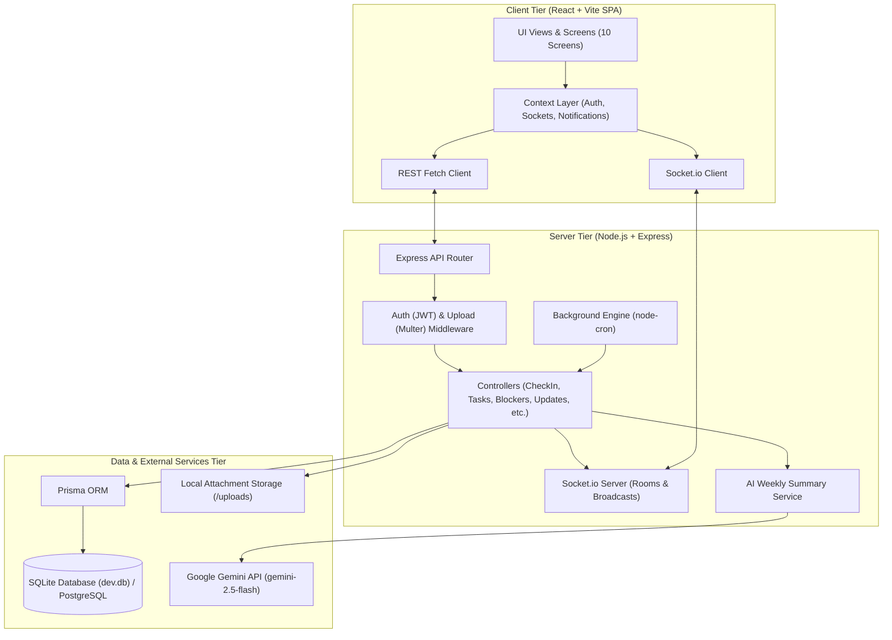
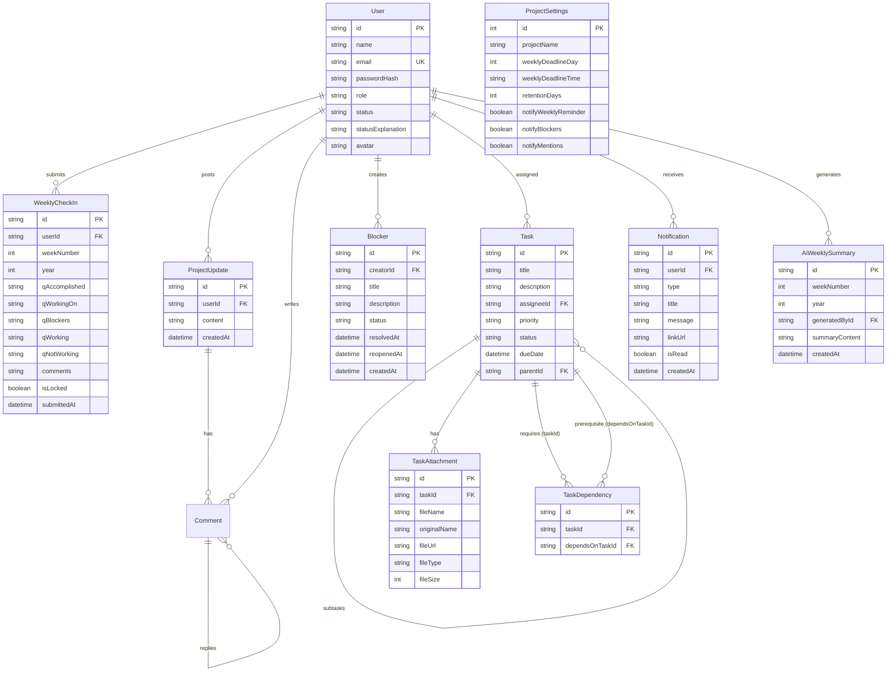
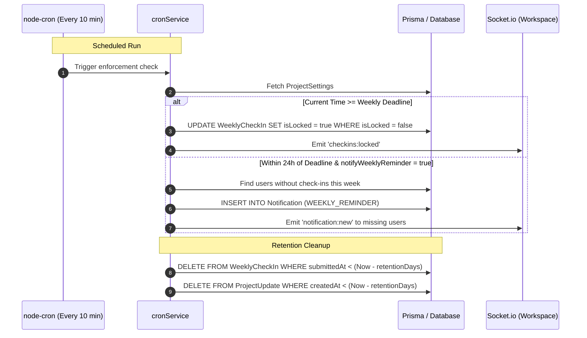

# System Architecture Document — SyncPulse

**Project:** Weekly Feedback & Project Collaboration Tool  
**Document Version:** 1.0  
**Based on:** [_docs/plan.md](file:///d:/Learning/ai-dev-tools-experiment/project-feedback/_docs/plan.md) (Option 3: Node.js/Express + React/Vite + Socket.io + SQLite/Prisma)

---

## 1. Executive Summary

SyncPulse is a single-project team collaboration and weekly feedback application built for high-transparency teams. It unifies weekly structured check-ins, continuous anytime updates with `@mentions`, real-time blocker management with in-app notifications, task management with multiple Directed Acyclic Graph (DAG) dependencies, and admin-triggered AI weekly project summaries.

### Architecture Highlights
- **Client**: React 18/19 Single Page Application built with Vite and TypeScript, styled with a modern vanilla CSS design token system (dark/light contrast, glassmorphism, responsive cards).
- **Server**: Node.js with Express and TypeScript, exposing a clean REST API.
- **Real-Time Layer**: Socket.io for bi-directional live events (blocker alerts, `@mention` toasts, status badges).
- **Persistence**: Prisma ORM with SQLite for zero-configuration local development, architected with schema parity for instant migration to PostgreSQL.
- **Schedulers**: `node-cron` for automated deadline locking, weekly submission reminders, and data retention pruning.
- **AI Intelligence**: Google Gemini API (`@google/genai`) for synthesizing multi-dimensional weekly project summaries.

---

## 2. High-Level Architecture Diagram

---

## 3. Data Architecture & Entity-Relationship Model

### 3.1 Entity Relationship Diagram

### 3.2 Task Dependency Graph & Cycle Detection
Tasks support multiple prerequisite dependencies. To prevent circular deadlocks (e.g. $A \rightarrow B \rightarrow C \rightarrow A$), the server uses a **Depth-First Search (DFS) / Breadth-First Search (BFS) Cycle-Detection Algorithm** prior to inserting or modifying records in `TaskDependency`:
1. When adding dependency $X \rightarrow Y$ ($X$ requires $Y$), the system checks if $X$ can already be reached starting from $Y$.
2. If reachable, the request is rejected with HTTP `400 Bad Request` (`Circular dependency detected`).

---

## 4. Frontend Screen Specifications (Section 18 of plan.md)

| # | Screen | Primary Components | Key Actions | Permissions | Empty / Error States |
|---|---|---|---|---|---|
| **1** | **Login / Project Access** | Login Card, Quick-Demo Switcher (Admin vs Member accounts), Auth Status | Authenticate, switch demo personas | Public | "Invalid credentials" error banner |
| **2** | **Project Dashboard** | Progress Gauge (% complete), Status Distribution Bar, Active Blockers Banner, Accomplishments Ticker, Weekly Participation Card | Navigate to specific areas, quick-change my status | All team members | Zero-state placeholder cards with prompt to add first task |
| **3** | **Weekly Check-In** | 5 Structured Question Inputs, Comments Field, Deadline Countdown, Submission State Badge | Submit update, edit before deadline, view past weeks | Team Members / Admin | If locked: read-only mode banner with deadline timestamp |
| **4** | **Anytime Updates Feed** | Composer box with `@mention` parser, Threaded Update Cards, Nested Comment Accordion | Post update, reply to updates, click @mentions | All team members | "No updates posted this week yet" with prompt |
| **5** | **Blockers Board** | Active Blockers List, Resolved Blockers History, Create Blocker Modal, Resolution Action | Report blocker, creator resolves, admin reopens | All create; Creator/Admin resolve; Admin reopens | "No active blockers — smooth sailing!" banner |
| **6** | **Tasks Board** | Kanban Column View (To Do / In Progress / Completed) & List View toggle, Priority Badges, Due Date Alarms | Drag/toggle status, filter by assignee/priority, create task | All team members | "No tasks found" with "+ New Task" button |
| **7** | **Task Detail & Modal** | Dependency Tree Graph/List, Subtask Checklist, Drag-and-drop Attachment Uploader, Activity Trail | Add/remove dependencies, check off subtasks, upload screenshots | All team members | Circular dependency warning modal on invalid link |
| **8** | **Team Members Directory** | Member Grid Cards, Current Status Pills (On Track, At Risk, Blocked, Completed), Personal Explanation | Edit personal status & note, view colleague profiles | All view; Users update their own status | Loading skeletons while fetching users |
| **9** | **AI Weekly Summary** | Markdown Document Viewer, "Generate Weekly Summary" CTA, Historical Week Selector, Copy/Export | Admin triggers generation, team views summary | Admin triggers; All view | "No summary generated for this week yet. Admin can click Generate." |
| **10** | **Project Admin Settings** | Deadline Picker (Day & Time), Retention Period Slider, In-App Notification Toggles, Team Management | Update deadline, configure retention, toggle notification channels | Project Admin only | 403 Forbidden alert if accessed by Team Member |

---

## 5. Real-Time & Notification Architecture

### 5.1 Socket.io Rooms and Channel Model
The application uses two levels of Socket.io rooms:
1. **Workspace Room (`workspace`)**: All authenticated clients join this room upon connection. Used for team-wide UI synchronization:
   - `blocker:created`
   - `blocker:resolved`
   - `blocker:reopened`
   - `update:created`
   - `comment:created`
   - `task:created`, `task:updated`, `task:deleted`
   - `user:status_updated`
   - `checkins:locked`
2. **User Room (`user:<userId>`)**: Targeted private room for notifications:
   - `notification:new`: Dispatched directly to the recipient when mentioned via `@mention`, when reminded of an impending deadline, or when assigned a task.

### 5.2 Notification Toggle Enforcement
Before creating or broadcasting notifications, the system checks `ProjectSettings`:
- `notifyBlockers`: Controls whether blocker creation/reopening creates in-app notification records and triggers toasts.
- `notifyMentions`: Controls whether `@mention` parsing generates notification items for tagged teammates.
- `notifyWeeklyReminder`: Controls whether the cron job creates reminder notifications 24 hours prior to the weekly deadline.

---

## 6. Background Scheduling & Compliance Engine

Managed via `node-cron` inside the Node.js process:

---

## 7. AI Weekly Summary Pipeline

The AI Weekly Summary combines real data from across the workspace to give an objective executive overview:

1. **Aggregation Step**: Queries current week's check-ins, tasks (completed vs in progress), active and recently resolved blockers, updates, and team statuses.
2. **Prompt Formulation**: Structured system prompt enforces 7 strict sections matching the spec:
   - Overall Project Progress & Health
   - Key Accomplishments
   - Current & Ongoing Work
   - Critical Blockers and Risks
   - What Is Working Well
   - Areas for Improvement (What Is Not Working)
   - Actionable Recommendations for Next Week
3. **Execution**: Calls the Google Gemini API (`gemini-2.5-flash` via `@google/genai`). If no API key is provided, an intelligent algorithmic synthesis engine generates a complete, formatted report directly from the live database records.
4. **Persistence & Distribution**: Stored in `AiWeeklySummary` and immediately accessible to all team members on the AI Summary screen.

---

## 8. Role-Based Access Control (RBAC) Matrix

| Action | Team Member | Project Admin | Enforcement Layer |
|---|:---:|:---:|---|
| **View Dashboard, Feed, Tasks, Blockers, Summaries** | ✅ | ✅ | Database / API (All transparent) |
| **Submit / Edit Own Weekly Check-In (Before Deadline)** | ✅ | ✅ | Controller & DB Lock Check |
| **Edit Weekly Check-In (After Deadline)** | ❌ | ❌ | Strictly Read-Only for everyone |
| **Post Anytime Update & Threaded Comments** | ✅ | ✅ | Controller (Non-deletable audit log) |
| **Create Blocker** | ✅ | ✅ | Controller |
| **Resolve Blocker** | ✅ *(Creator only)* | ✅ | Controller Ownership / Admin Check |
| **Reopen Resolved Blocker** | ❌ | ✅ | Controller `requireAdmin` Guard |
| **Create, Edit, Assign Tasks & Subtasks** | ✅ | ✅ | Controller |
| **Upload Task Attachments** | ✅ | ✅ | Multer & Controller |
| **Update Own Project Status & Explanation** | ✅ | ✅ | Controller (Scoped to `req.user.id`) |
| **Update Colleague's Status** | ❌ | ❌ | Manual per-member ownership |
| **Trigger AI Weekly Summary Generation** | ❌ | ✅ | Controller `requireAdmin` Guard |
| **Configure Deadline, Retention & Notifications** | ❌ | ✅ | Controller `requireAdmin` Guard |

---

## 9. Security & Data Integrity Principles

1. **Auditability (Non-Deletable Core Records)**:
   - In adherence with [_docs/plan.md](file:///d:/Learning/ai-dev-tools-experiment/project-feedback/_docs/plan.md), submitted weekly check-ins and project updates cannot be deleted via the API.
2. **Password Security**: Passwords hashed using `bcryptjs` with salt factor 10.
3. **Stateless Authentication**: Signed JSON Web Tokens (JWT) verified on all protected API routes and during Socket.io handshakes.
4. **File Upload Hardening**:
   - File size capped at 15 MB.
   - Upload filenames randomized using timestamp and crypto-random prefixes.
   - Served via static route with correct MIME headers.
5. **Data Retention**:
   - Automatic background pruning of records past the configurable retention horizon (`retentionDays`), keeping the database lean and compliant.
